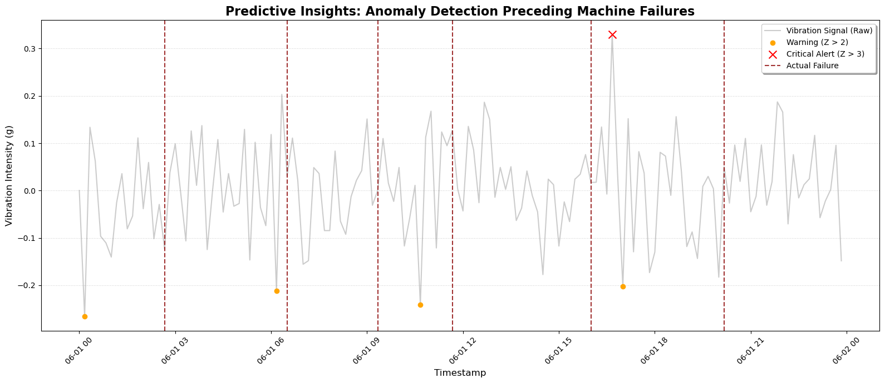

# Sensor Performance Analytics | Industrial IoT & KPI Monitoring

In this project, I built a monitoring framework for CNC manufacturing equipment using multi-sensor industrial data. The goal was to go beyond simple anomaly detection and create a health scoring system that shows degradation trends before failures happen.

The model combines vibration behavior, temperature drift, and alert concentration into a single Machine Health Index (0–100). By including vibration velocity (rate of change), it became more sensitive to gradual and rapid performance drifts.

As a result, the system was able to detect performance decline about 3 hours before critical failure events.

  

## Repository Structure
- `notebooks/` – Python analysis (EDA, KPI engineering, anomaly detection)  
- `data/`  
  - `raw/` – Original industrial sensor dataset  
  - `processed/` – Engineered dataset (`processed_sensor_data.csv`)  
- `powerbi/` – Dashboard files  
- `images/` – Visualizations  

## Data Attribution
- **raw/** dataset provided by Santosh Kumar (IEEE DataPort)  
- **processed/** dataset, analytical logic, KPI definitions, and anomaly detection framework are my original work.

## Tech Stack
- Python: Pandas, NumPy, Matplotlib
- Power BI: Interactive Dashboards, Advanced DAX, Time-Series Visualization
- Analytics: Time-Series Analysis | Statistical Outlier Detection | Feature Engineering

## Author
**Soheyla Moghadam**  
Data Analyst | Industrial IoT
